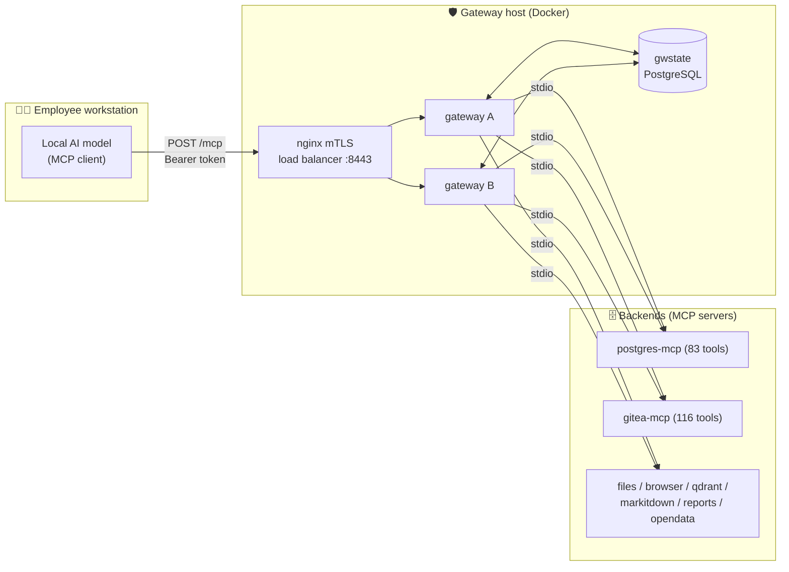

<div align="center">

# 🛡️ Secure MCP Gateway

**A zero-trust control plane between your employees' AI assistants and your internal systems.**

Employees bring their **own local AI** — the gateway runs **no model**. Every tool call the AI proposes is authenticated, authorized, inspected, approved when destructive, and written to a tamper-evident audit log. **Nothing ever leaves your infrastructure.**


-orange)

[Quick start](#-quick-start) · [Architecture](#%EF%B8%8F-architecture) · [Testing](#-testing) · [Deployment](#-deployment) · [Status](#-project-status) · [Docs](#-documentation)

</div>

---

## ✨ What it does

| | Capability |
|---|---|
| 🔐 | **Two-factor login** — PBKDF2 (600k iterations) passwords + TOTP authenticator, short-lived ES256 session tokens, anti-hammering lockout |
| 🎫 | **OAuth 2.1 self-onboarding** for AI clients — dynamic registration, PKCE, rotated refresh tokens, plus scoped API keys |
| 🧮 | **ABAC authorization** — role × clearance × data classification × tool risk tier, deny-by-default (`policy.yaml`) |
| 🧪 | **Prompt-injection containment** — taint tracking: a value that came from tool output can never auto-execute a write |
| 👥 | **Human-in-the-loop approvals** — Tier 2 needs one approver, Tier 3 needs two with separation of duties |
| 🕵️ | **DLP masking** — Saudi National ID / Iqama / IBAN detected (with checksums) and masked below the required clearance |
| 🔗 | **Tamper-evident audit** — keyed HMAC-SHA256 hash chain, group-committed, with per-call latency recorded |
| 🚨 | **Containment** — kill switches (global / server / tool / user), 3-key rate limits, per-server circuit breakers |
| 📦 | **Tool governance** — hash-pinned registry; a tool that silently changes is auto-quarantined ("rug-pull" defense) |
| 🖥️ | **19-page admin console** — React, bilingual English/Arabic (RTL), every number measured, every control real |
| 🏢 | **HA-ready** — two instances, shared PostgreSQL state, no sticky sessions; a node kill drops zero sessions |

## 🏗️ Architecture

The gateway is a pure **Policy Enforcement Point (PEP)**: MCP clients connect inbound, the gateway enforces an **18-stage security pipeline**, then fans out to backend MCP servers.



Every `tools/call` passes: edge guard → auth → session → kill switch → rate limits → entitlement → registry + hash pin → circuit breaker → drain → key tier cap → Unicode sanitize → size caps → strict schema validation → taint check → ABAC → HITL approval → vault credential injection → result governance (truncate, taint, DLP mask) — with an audit record at every step.

## 🚀 Quick start

**Prerequisites:** Python 3.11+, `pip`. (Docker + Node only needed for connector tests / dashboard work.)

```bash
cd gateway
pip install -r requirements.txt        # ⚠️ mcp==1.8.1 is pinned on purpose — see Gotchas

python -m uvicorn app.main:app --host 127.0.0.1 --port 8800
# → open http://127.0.0.1:8800/   (dev PKI is auto-generated on first run)
```

**First boot has no operators.** Bootstrap one (sets password + enrolls TOTP, prints the `otpauth://` URI once):

```bash
python scripts/seed_credentials.py
```

Demo operators: `sara` (employee) · `khalid` (analyst) · `noura` / `faisal` (approvers) · `admin`.

### 🔌 Connect your AI

Open **`/connect`** in the console — the wizard generates a ready-to-paste config for Claude Code, LM Studio, or any OAuth-capable MCP client. Clients speak MCP (Streamable HTTP) to `POST /mcp`. Full guide: [`gateway/docs/CONNECT-YOUR-AI.md`](gateway/docs/CONNECT-YOUR-AI.md).

## 🧪 Testing

~340 test functions across 19 files. All suites are green at handover.

```bash
# 1️⃣ Offline suites — no server, no Docker
python -m pytest tests/ -q --ignore=tests/test_e2e.py --ignore=tests/test_oauth.py \
                           --ignore=tests/test_admin_controls.py

# 2️⃣ Live suites — start the gateway on :8800 FIRST (kill any stale one! see Gotchas)
python -m pytest tests/test_e2e.py tests/test_oauth.py tests/test_admin_controls.py -q

# 3️⃣ Everything — connector & shared-state suites skip cleanly without their Docker fixtures
docker run -d --name mcp-test-pg -e POSTGRES_PASSWORD=mcptest -e POSTGRES_DB=mcpdb \
  -p 15432:5432 postgres:17          # (+ mcp-test-gitea & TEST_GITEA_TOKEN for the Gitea suite)
python -m pytest tests/ -q
```

## 📁 Project structure

<details>
<summary><b>Click to expand the repo map</b></summary>

```
gateway/
├── app/                      # 🧠 the control plane — 27 modules, ~9,600 LOC, ~80 routes
│   ├── main.py               #    FastAPI app + route wiring
│   ├── gateway.py            #    ⭐ the 18-stage enforcement pipeline — read this first
│   ├── mcp_server.py         #    inbound POST /mcp (Streamable HTTP)
│   ├── mcp_manager.py        #    outbound stdio MCP clients + circuit breaker
│   ├── auth.py · pki.py      #    login (PBKDF2+TOTP), ES256 tokens, dev CA
│   ├── oauth.py              #    OAuth 2.1 authorization server (DCR, PKCE)
│   ├── authz.py              #    ABAC decisions over policy.yaml
│   ├── registry.py           #    tool registry: hash pinning, drift quarantine
│   ├── approvals.py          #    tiered HITL, two-person Tier 3
│   ├── taint.py              #    prompt-injection taint tracking
│   ├── dlp.py                #    Saudi PII detection + clearance-gated masking
│   ├── audit.py              #    HMAC hash-chained audit log
│   ├── controls.py           #    kill switches + 3-key rate limits
│   ├── statestore.py         #    ⭐ flat-file ⇄ shared-PostgreSQL state seam
│   └── ...                   #    vault, apikeys, anomaly, insights, settings, selfinfo…
├── servers/                  # 🔌 MCP connectors (postgres 83 · gitea 116 · files 6 ·
│                             #    browser 8 · markitdown 4 · qdrant 10 · reports 2)
├── dashboard/                # 🖥️ React 18/Vite/Tailwind 4 console source (19 pages, AR/EN + RTL)
├── ui/                       # 📦 built console bundle served by the gateway (CI checks drift)
├── tests/                    # ✅ ~340 test functions
├── deploy/                   # 🔒 nginx mTLS, dev CA scripts, postgres init, Docker secrets
├── scripts/                  # 🛠️ backup / restore drill / load test / state migration / seeding
├── config.yaml               # dev config   (config.prod.yaml = production; validated at startup)
├── policy.yaml               # ABAC roles, clearances, tool tiers
├── docker-compose*.yml       # dev · tls · prod · ha
├── PROJECT-PLAN.md           # ⭐ canonical plan: status, risks, decisions, roadmap
└── OPERATIONS.md             # ⭐ runbook: bootstrap, secrets, backups, HA, incident response
```

</details>

## ⚙️ Configuration & state modes

The gateway runs in one of **two state modes** — the code is identical, only the backend changes:

| Mode | Trigger | State lives in | Use |
|---|---|---|---|
| 📄 Flat files | `MCP_STATE_DB_URL` **unset** | `gateway/data/*.json(l)` | dev & tests, zero setup |
| 🐘 Shared PostgreSQL | `MCP_STATE_DB_URL` **set** | `gwstate` database | production & HA |

**Fail-closed:** if the URL is set but the database is unreachable, the gateway refuses to boot. Migrate either direction with `scripts/migrate_state.py` (verifies the audit chain before **and** after). All state access goes through `app/statestore.py` — never touch `data/` files directly from new code.

## 🐳 Deployment

| Stack | Command | What you get |
|---|---|---|
| Dev | `docker compose up` | single container |
| Production | `docker compose -f docker-compose.prod.yml up` | postgres:17 + gateway (`MCP_ENV=production`) + nginx **mTLS** on :8443 (only entry) |
| **HA** ⭐ | `docker compose -f docker-compose.ha.yml up` | 2 gateway instances, shared `gwstate`, no sticky sessions — a node kill drops **zero** sessions (drilled) |

- 🔑 Secrets are Docker **file-secrets** in `deploy/secrets/` — never in images, never in git. Production tripwires make dev secrets fatal.
- 💾 Backups: `scripts/backup.ps1` daily (pg_dump + data + PKI + Gitea, 14-day retention, `-Offsite` mirror). Restore drill: `scripts/restore_drill.ps1` — **run monthly**; measured RTO 38.7 s.
- 📖 Full procedures: [`gateway/OPERATIONS.md`](gateway/OPERATIONS.md).

## 📊 Project status

**≈70% of the way to production.** The security engine and console are done; what remains is mostly security operations and accreditation.

- [x] **Phase 0** — real prod stack: postgres:17, real secrets, mTLS, backups *(2026-07-06)*
- [x] **Phase 1** — production connectors on real systems, least-privilege *(2026-07-06)*
- [x] **Client access** — OAuth 2.1 AS + `/connect` wizard *(2026-07-06)* · **Admin surface** *(2026-07-09)*
- [x] **Phase 2** — truth & console completion: every number measured, every control real; employee-zero passed end-to-end; 3 new connectors *(2026-07-12)*
- [x] **Phase 3** — shared PostgreSQL state + HA pair + restore drill (RTO 38.7 s); 4 perf bugs found & fixed (p50 1564→251 ms) *(2026-07-13)*
- [ ] **Phase 4** — SecOps: Wazuh SIEM, webhook+SMTP alerting, WORM retention, Arabic NER DLP, red-team CI gate, IR drills
- [ ] **Phase 5** — pilot 10–20 users, tune thresholds, department rollout
- [ ] **Phase 6** — pen test, org PKI, DR site, compliance matrix, formal risk sign-off
- [ ] ⏱️ **Open engineering item:** prove p95 ≤ 150 ms at 300 concurrent on real Linux nodes (`scripts/loadtest.py --provision 300`) — risk **R12**

The defining accepted-pending risk: **R1 — the gateway authenticates the person, not their model.** Read `PROJECT-PLAN.md` §8 before touching anything security-relevant.

## ⚠️ Gotchas

> The things that will actually burn you. Read these before your first PR.

1. **`mcp==1.8.1` is pinned deliberately.** A range pin once drifted to an SDK that broke every connector import — the gateway couldn't boot. Upgrade only with `tests/test_servers_import.py` green.
2. **Stale gateway on :8800.** Live suites silently test the *old* process. Wholesale `test_e2e` timeouts ⇒ kill the port holder first.
3. **`ui/` is a committed build artifact.** After touching `dashboard/src`, run `npm run build`; CI has a drift check.
4. **Pending tools are inert on purpose.** New/changed tools require Risk-Board approval in the console; changed hashes auto-quarantine.
5. **Dev edges are dev-grade knowingly** — dev CA, file secrets, `host.docker.internal`. Each has a documented production swap point (`PROJECT-PLAN.md` §9).
6. **Windows host today, Linux target tomorrow** (risk R9) — don't add Windows-only dependencies.

## 📚 Documentation

| Document | Read it for |
|---|---|
| 📘 [`handover/MCP-Gateway-Documentation.docx`](handover/MCP-Gateway-Documentation.docx) | **The full picture, in plain language** — concepts, architecture, what was built phase by phase, module reference, ops, risks, roadmap |
| ⭐ [`gateway/PROJECT-PLAN.md`](gateway/PROJECT-PLAN.md) | Canonical status, risk register, org decisions, phase exit criteria |
| ⭐ [`gateway/OPERATIONS.md`](gateway/OPERATIONS.md) | Runbook: bootstrap → backups → HA failure modes → incident response |
| [`gateway/README.md`](gateway/README.md) | Technical controls table, demo walkthrough, production swap points |
| [`gateway/docs/CONNECT-YOUR-AI.md`](gateway/docs/CONNECT-YOUR-AI.md) | End-user guide: connecting an AI client |
| [`docs/design/`](docs/design/) | Design/research corpus — architecture BuildSpecs, security blueprint, auth redesign (background — the plan supersedes it) |
| [`docs/research/`](docs/research/) | STORM research briefings (MCP server landscape, company stacks) |

**Suggested first week:** this README → the docx → `PROJECT-PLAN.md` → `app/gateway.py` top-to-bottom → `OPERATIONS.md` → `tests/test_e2e.py`.

---

<div align="center">
<sub>Built on-prem, for on-prem. Your AI never phones home. 🏠</sub>
</div>
